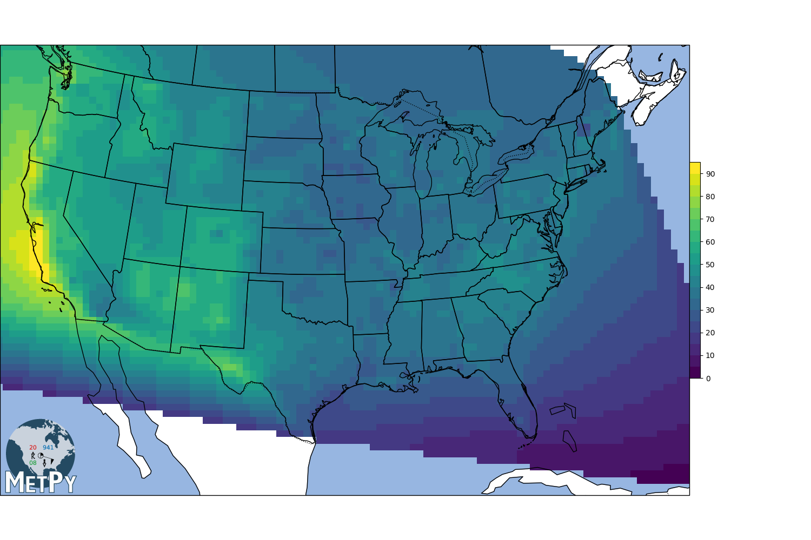

# climatefind

A project to help find the right climate.

## Global Historical Climatology Network (GHCN) Version

Green is better.  Red is worse.

To zoom in, you will need to [download the 22MB+ HTML file](https://github.com/jgspratt/climatefind/blob/master/ghcn/output/average_comfy_days.Stamen_Terrain.html?raw=true) (right-click, "download" or "save link as").

See also the [OpenStreetMap version](https://github.com/jgspratt/climatefind/blob/master/ghcn/output/average_comfy_days.OpenStreetMap.html?raw=true) with more street-level detail but less terrain detail.

You will have to do this on a computer with a desktop operating system.
Save the file somewhere and then open it up with your browser.
Github can't seem to serve it directly to your browser.
Be patient when opening it: it can take 10+ seconds to render: there are 16,000 weather stations to render and a 20-layer contour to render on top of that.

The next generation software was based on the [GHCN data set](https://www.ncei.noaa.gov/data/daily-summaries/archive/daily-summaries-latest.tar.gz).
As of 2021-01-01, this project is starting.

The main advantage of this version is the geographic density of locations (approximately 60,000 US locations in total over the entire data set with approximately 16,000 with at least one complete year of temperature records).
The main disadvantage of this version is the lack of hourly granularity and humidity data.

### What counts as a comfortable day?

Configuration for these parameters is found in [ghcn/env/env.yml][ghcn/env/env.yml].
As it is set currently (2021-01-11), the logic is as follows:

* A day is comfortable if the daily high fell between 10 (50F) and 20C (68).
* A day is comfortable if the daily high fell above 20C AND the daily low fell below 14C.
* Any other day is uncomfortable.

Why these numbers?

* I don't have humidity data, so I need to work with what I have.
* A temp of 20C (68F) with a dew point of 20C is pretty uncomfortable to me.
    * But I haven't seen many days with a high of 68F that had a dew point of 68F, because the daily low would probably squeeze the water out.
    * Days that go above 20C, I can't really trust them without knowing the low: if the low is, say, 19C and the high is 28C, the dew point could easily be 19C and a 28C temp with a 19C dew point is not a comfortable day.
* Days that go above 20C but go below 14C squeeze the humidity out down to an acceptable level in my view.
    * Sure, the high could be 40C in theory, but the temp couldn't go from 14C to 40C without going through a whole bunch of comfortable temps for a good number of hours.
* Yes, I'm missing days of perfect weather that hover in the low 20's and have low humidity, but the map seems to show that my estimate here is pretty good: it by and large agrees with the TMY3 calculation, which is, if I may say so, a gold standard.
* I'm not counting any other metrics: just the daily high and low.

## Typical Meteorological Year v3 (TMY3) Version

Yellow is better.  Blue is worse.

The original version of this application used the TMY3 data which was available from [nsrdb.nrel.gov](https://nsrdb.nrel.gov/about/tmy.html) in CSV format.
Unfortunately, this version does not seem to be publicly available anymore, however, I have an archived copy.
The zipped version of the file was only 226 MB and contained detailed hourly weather data from 1,020 US locations.

The main advantage of this version was it's use of very high quality hourly data including humidity.
The main disadvantages of this version were (1) its computational complexity (due to the comfort model calculations) and (2) the low geographic density (essentially, only airports and high tech installations). 

The main configurable parameters were set in `config.yml` which allows the user to specify their personal preferences.
The resulting output graphs were generated and stored in the `output/` directory.

### What counts as a comfortable day?

Configuration is specified in [tmy3/config.yml](tmy3/config.yml).

* This is a much more complex algorithm than the GHCN version.
* A day is comfortable if it has at least 6 comfortable hours.
* An hour is comfortable if it meets the following criteria:
    * The hour is after `0900` local (it is not to early)
    * The hour is before `1800` local (it is not too late)
    * The dew point is `<=15C` (it is not sticky)
    * The extra terrestrial radiation is `>= 10 W/m^2` (it is light out)
    * There is no precipitation (`0 mm`)
    * The windspeed is `<=10 m/s`
    * The Standard Effective Temperature of `25.6C` (where, by definition, 90% of the population is comfortable) is between the following two calculated Standard Effective Temperatures:
        * The prevailing environmental conditions plus a metabolic rate of `5` (fast walk) plus a clothing factor of `0.8` (slightly less than a full business suit)
        * The prevailing environmental conditions plus a metabolic rate of `3` (normal walk) plus a clothing factor of `0.4` (slightly more than walking shorts)
* In addition, the `Fast vars` are also available for a faster way to calculate the day with less computing power.

## Monthly GHCN Graphics

### January

***

 

### February

***

 

### March

***

 

### April

***

 

### May

***

 

### June

***

 

### July

***

 

### August

***

 

### September

***

 

### October

***

 

### November

***

 

### December

***
